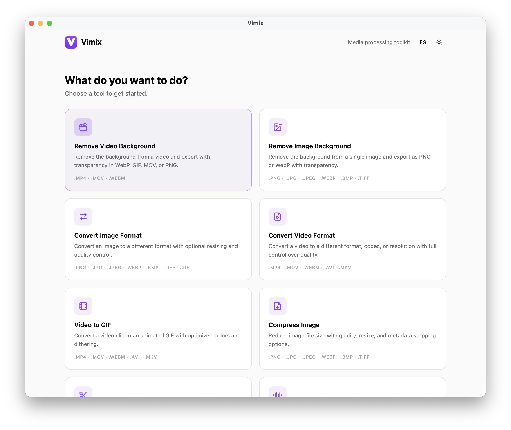
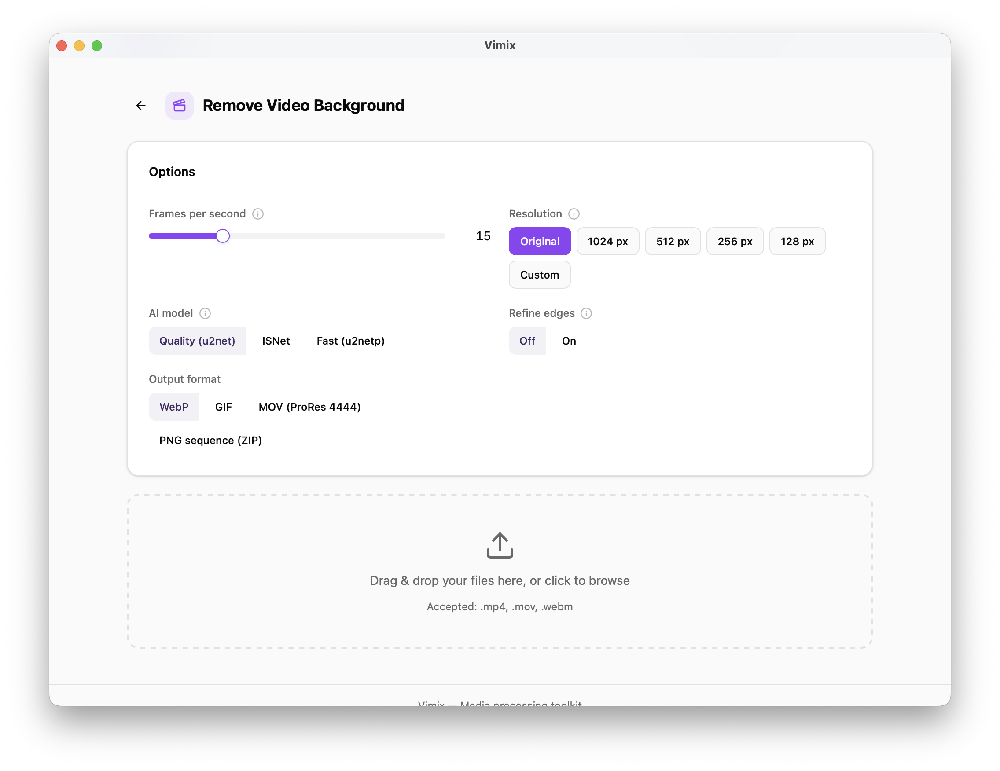

# Vimix

Local AI-powered media processing toolkit. Remove video backgrounds, convert formats, compress, trim, extract audio, and more — all running on your machine. No cloud, no uploads, no API keys. Everything runs locally.

<p align="center">
  
</p>

<p align="center">
  
</p>

## Download

Download the latest version for your platform:

| Platform | Download |
|----------|----------|
| macOS (Apple Silicon) | [Vimix.dmg](https://github.com/kike1303/vimix/releases/latest/download/Vimix_aarch64.dmg) |
| Windows (x64) | [Vimix.msi](https://github.com/kike1303/vimix/releases/latest/download/Vimix_x64-setup.msi) |

Or browse all releases on the [Releases page](https://github.com/kike1303/vimix/releases).

## Features

- **Video Background Removal**: Upload an MP4/MOV/WebM, get an animated WebP with transparent background
- **Image Background Removal**: Remove backgrounds from images (PNG, JPG, WebP)
- **Format Conversion**: Convert between video/image formats
- **Video Compression**: Reduce file sizes with quality controls
- **Video Trimming**: Cut clips with start/end time
- **Audio Extraction**: Pull audio from video files
- **Video to GIF**: Convert videos to animated GIFs
- **Image Compression**: Optimize image file sizes
- **Image Watermark**: Add text watermarks to images
- **PDF to Image**: Convert PDF pages to images
- **Video Thumbnails**: Extract thumbnail frames from videos
- **Batch Processing**: Process multiple files at once
- **Real-time progress**: SSE-powered live progress updates
- **Dark/Light mode**: Automatic theme detection with manual toggle
- **Multilanguage**: English and Spanish
- **Desktop App**: Native macOS app via Tauri (Windows/Linux planned)

## Prerequisites

- **Node.js** >= 20
- **pnpm** >= 9
- **Python** 3.9+
- **FFmpeg** (`brew install ffmpeg` on macOS, `apt install ffmpeg` on Ubuntu)
- **libwebp** / img2webp (`brew install webp` on macOS, `apt install webp` on Ubuntu)

## Quick Start (Web)

### 1. Install dependencies

```bash
# Node dependencies
pnpm install

# Python virtual environment
cd services/processor
python3 -m venv venv
source venv/bin/activate
pip install -r requirements.txt
cd ../..
```

### 2. Run both services

```bash
pnpm dev:all
```

This starts the frontend at **http://localhost:5173** and the API at **http://localhost:8787**.

You can also run them separately:

```bash
# Terminal 1 – API server (requires venv activated)
cd services/processor
source venv/bin/activate
uvicorn app.main:app --reload --port 8787

# Terminal 2 – Frontend
pnpm dev
```

## Desktop App (Tauri)

Vimix can also run as a native desktop app using Tauri 2. The app bundles everything (frontend + Python backend + FFmpeg) so the user doesn't need to install anything.

### Additional prerequisites

- **Rust** toolchain (install via [rustup.rs](https://rustup.rs/))

### Setup

```bash
# 1. Build the Python sidecar (one-time, requires venv activated)
cd services/processor
source venv/bin/activate
pip install pyinstaller
pyinstaller vimix-processor.spec

# 2. Copy the sidecar binary to Tauri's expected location
#    Replace the suffix with your platform:
#      aarch64-apple-darwin     (macOS ARM)
#      x86_64-apple-darwin      (macOS Intel)
#      x86_64-pc-windows-msvc   (Windows, add .exe)
#      x86_64-unknown-linux-gnu (Linux)
cp dist/Vimix-processor apps/web/src-tauri/binaries/Vimix-processor-aarch64-apple-darwin
cd ../..

# 3. Download static FFmpeg/img2webp binaries
./scripts/download-desktop-binaries.sh

# 4. Run the desktop app in dev mode
pnpm tauri:dev
```

### Build for distribution

```bash
pnpm tauri:build
```

Output: `apps/web/src-tauri/target/release/bundle/` (`.dmg` on macOS, `.msi` on Windows, `.AppImage` on Linux).

See [docs/desktop-app.md](docs/desktop-app.md) for full details.

## Troubleshooting

### "Could not connect to the API" in the browser

The Python backend is not running. Make sure you:
1. Activated the virtual environment: `cd services/processor && source venv/bin/activate`
2. Started the API: `uvicorn app.main:app --reload --port 8787`
3. Or use `pnpm dev:all` which starts both services

### Python module not found errors

Make sure you're in the virtual environment and all deps are installed:

```bash
cd services/processor
source venv/bin/activate
pip install -r requirements.txt
```

### FFmpeg / img2webp not found

Video processors need FFmpeg and img2webp on your system PATH:

```bash
# macOS
brew install ffmpeg webp

# Ubuntu/Debian
sudo apt install ffmpeg webp
```

### Desktop app: loading screen stays forever

The PyInstaller sidecar binary can take 20-30 seconds to start on first launch (it decompresses to a temp directory). If it never loads:

1. Check the sidecar was built: `ls apps/web/src-tauri/binaries/Vimix-processor-*`
2. Check the resources were downloaded: `ls apps/web/src-tauri/resources/`
3. Try running the sidecar manually to see errors: `./apps/web/src-tauri/binaries/Vimix-processor-aarch64-apple-darwin --port 9999`

### Desktop app: PyInstaller build fails with metadata errors

Some packages need explicit metadata bundling. If you see `PackageNotFoundError`, make sure `vimix-processor.spec` includes the package in the `copy_metadata()` list.

### Port already in use

If port 8787 is busy, either kill the process using it or set a custom port:

```bash
uvicorn app.main:app --reload --port 9000
VITE_API_URL=http://localhost:9000 pnpm dev
```

## Project Structure

```
vimix/
├── apps/web/                  # SvelteKit 5 + TailwindCSS v4 + shadcn-svelte
│   ├── src/
│   │   ├── routes/            # Pages
│   │   ├── lib/components/    # App components + shadcn UI
│   │   └── lib/i18n/          # Translations (en, es)
│   └── src-tauri/             # Tauri desktop shell (Rust)
│       ├── binaries/          # PyInstaller sidecar (gitignored)
│       └── resources/         # Static ffmpeg/img2webp (gitignored)
├── services/processor/        # Python FastAPI
│   └── app/
│       ├── routers/           # HTTP endpoints
│       ├── processors/        # Processing pipelines (12 processors)
│       └── services/          # Job manager, file manager, binary paths
├── scripts/                   # Build scripts
│   └── download-desktop-binaries.sh
├── docs/                      # Documentation
└── pnpm-workspace.yaml        # Monorepo config
```

## Documentation

- [Architecture](docs/architecture.md) — How the system works
- [API Reference](docs/api.md) — All endpoints
- [Adding Processors](docs/adding-processors.md) — How to add new tools
- [Desktop App](docs/desktop-app.md) — Tauri desktop build details
- [Deployment](docs/deployment.md) — Production web deployment

## Tech Stack

| Layer | Technology |
|-------|-----------|
| Frontend | SvelteKit 2, Svelte 5 (runes), TailwindCSS v4, shadcn-svelte |
| Backend | Python 3.9+, FastAPI, Uvicorn |
| AI/Processing | rembg (U2Net/ONNX), FFmpeg, img2webp |
| Desktop | Tauri 2 (Rust), PyInstaller |
| i18n | svelte-i18n (EN, ES) |
| Theming | mode-watcher (dark/light) |
| Monorepo | pnpm workspaces |

## Contributing

See [CONTRIBUTING.md](CONTRIBUTING.md) for development setup, conventions, and guidelines.

## License

MIT
